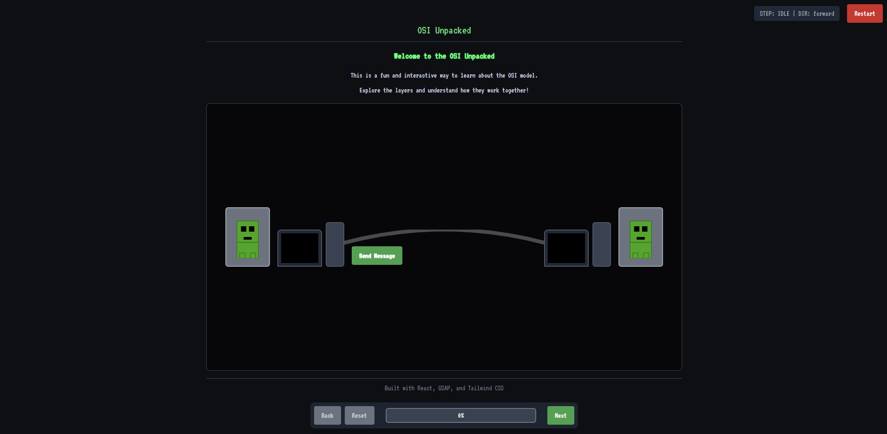

# 📦 OSI Unpacked

A cinematic, step-by-step visualizer for the OSI model, built with React, Vite, GSAP, and Tailwind CSS. This project aims to make the layers of network communication intuitive and engaging through pixel-art animation. 🎨

## 🚀 Live Demo

[https://osi-unpacked.vercel.app/](https://osi-unpacked.vercel.app/)

## 📸 Screenshot



## 🛠️ Tech Stack

-   **Framework**: [React](https://reactjs.org/) via [Vite](https://vitejs.dev/) ⚛️
-   **Animation**: [GSAP (GreenSock Animation Platform)](https://greensock.com/gsap/) & [Framer Motion](https://www.framer.com/motion/) ✨
-   **Styling**: [Tailwind CSS](https://tailwindcss.com/) 💅
-   **Icons**: [React Icons](https://react-icons.github.io/react-icons/) 👾
-   **Font**: [VT323](https://fonts.google.com/specimen/VT323) ✒️

## 💻 Local Development

To run this project locally, follow these steps:

1.  **Clone the repository:**
    ```bash
    git clone https://github.com/lem0n4id/osi-unpacked.git
    cd osi-unpacked
    ```

2.  **Install dependencies:**
    ```bash
    npm install
    ```

3.  **Run the development server:**
    ```bash
    npm run dev
    ```
    The application will be available at `http://localhost:5173`.

## 🙏 Credits

-   Inspired by the desire to make network education more visual and fun.
-   Built with the help of countless open-source libraries and community resources.
